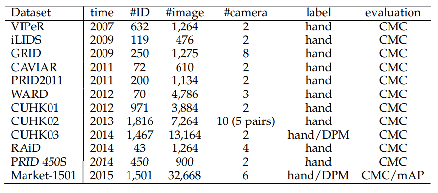

Person Re-Identification
========================

 

## Paper list

### 2018
* Deng, Weijian, et al. "Image-image domain adaptation with preserved self-similarity and domain-dissimilarity for person reidentification." in CVPR (2018) [[paper](http://openaccess.thecvf.com/content_cvpr_2018/papers/Deng_Image-Image_Domain_Adaptation_CVPR_2018_paper.pdf)]

### 2016
* Zheng, Liang, et al. "Person re-identification: Past, present and future."arXiv preprint arXiv:1610.02984 (2016). [[paper](https://arxiv.org/abs/1610.02984)]

### 2015
* Zheng, Liang, et al. "Scalable person re-identification: A benchmark." in ICCV (2015); [[paper](https://www.cv-foundation.org/openaccess/content_iccv_2015/papers/Zheng_Scalable_Person_Re-Identification_ICCV_2015_paper.pdf)] **← Market-1501 dataset**

### 2014 
* D. Yi, Z. Lei, S. Liao, S. Z. Li et al., “Deep metric learning for person re-identification.” in ICP. (2014) [[paper](https://ieeexplore.ieee.org/stamp/stamp.jsp?tp=&arnumber=6976727)]
* W. Li, R. Zhao, T. Xiao, and X. Wang, “Deepreid: Deep filter pairing neural network for person re-identification,” in CVPR (2014) [[paper](https://www.cv-foundation.org/openaccess/content_cvpr_2014/papers/Li_DeepReID_Deep_Filter_2014_CVPR_paper.pdf)]

 

## Datasets for Person Re-Idendification
 

